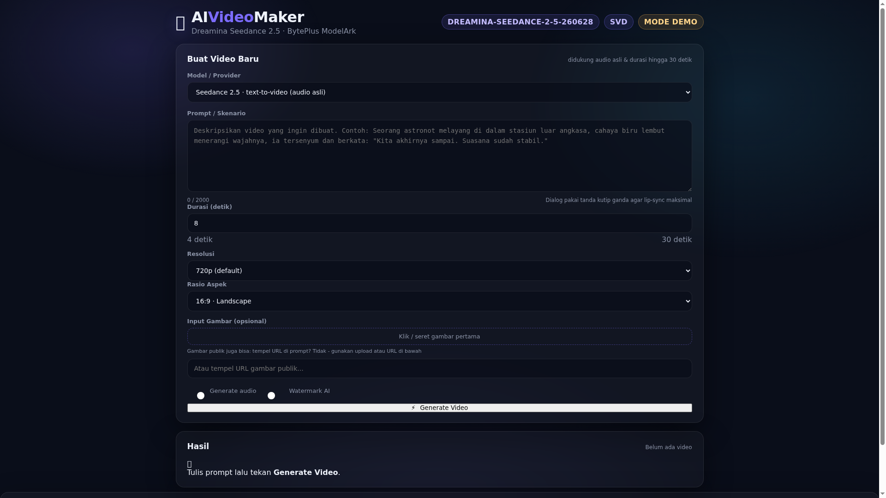

# 🎬 AI Video Maker — Seedance 2.5 + Stable Video Diffusion (SVD)

Aplikasi web **AI Video Maker** dengan dua provider untuk membuat video dari AI:

1. **Seedance 2.5** — model video generatif ByteDance (via **BytePlus ModelArk**).  
   Text-to-video, image-to-video, audio asli sinkron, durasi hingga 30 detik.
2. **Stable Video Diffusion (SVD)** — model **image-to-video** open-source milik Stability AI.  
   Gambar statis → video pendek (self-hosted via GPU, atau NVIDIA NIM API).

Aplikasi lengkap dengan **web UI** (FastAPI + vanilla JS), **API REST**, dan **CLI**.



---

## ✨ Fitur

**Seedance 2.5**
- Text-to-video dengan prompt bahasa natural (dialog dalam kutip ganda → lip-sync)
- Image-to-video (first frame) via upload / URL publik
- Audio asli: suara manusia + efek + musik sinkron
- Durasi 4–30 detik, resolusi 480p/720p/1080p, rasio 16:9 / 9:16 / 1:1 / dst.

**Stable Video Diffusion (SVD)**
- Image-to-video: animasikan gambar statis menjadi klip pendek
- Backend: NVIDIA NIM API (remote) atau local Diffusers (butuh GPU)
- Mode demo tanpa GPU/API key

**Umum**
- Mode **demo/simulasi** bawaan (tanpa biaya & tanpa API key)
- Progress bar polling status task
- Galeri riwayat (tersimpan di `data/history.json`)
- CLI `cli.py` untuk generate dari terminal
- Pilihan provider langsung di UI

---

## 🗂️ Struktur

```
project/
├── backend/
│   ├── main.py       # FastAPI app + routes (/api/*) + demo seedance
│   └── svd.py        # SVD client (NVIDIA NIM / local diffusers / demo)
├── static/
│   ├── index.html    # UI web
│   ├── app.js
│   └── style.css
├── cli.py            # CLI tool
├── requirements.txt
├── README.md
├── screenshots/
└── data/             # history.json, uploads/
```

---

## 🚀 Menjalankan (Web App)

```bash
python3 -m venv .venv && source .venv/bin/activate
pip install -r requirements.txt

# opsional: salin & isi API key
cp .env.example .env
export ARK_API_KEY=your-byteplus-key

python3 -m uvicorn backend.main:app --host 0.0.0.0 --port 8000
```

Buka **http://localhost:8000**

> Tanpa `ARK_API_KEY`, aplikasi berjalan dalam **mode demo** (Seedance & SVD disimulasikan).

### API key Seedance (BytePlus ModelArk)

1. Daftar di [console.byteplus.com/ark](https://console.byteplus.com/ark) (region **ap-southeast-1**)
2. Top up ≥ USD 30 / beli AI Savings Plan
3. Aktifkan model **Dreamina Seedance 2.5** di *Model activation*
4. Buat **API key** → set `ARK_API_KEY`

Model ID bawaan: `dreamina-seedance-2-5-260628` (override via `SEEDANCE_MODEL`).

### SVD backend

| Mode | Cara |
|------|------|
| **NVIDIA NIM** | `export NVIDIA_API_KEY=...` → SVD diproses remote via NVIDIA NIM |
| **Local (GPU)** | `export SVD_LOCAL=1` + install `torch diffusers pillow` → diproses lokal |
| **Demo** | tanpa keduanya → simulasi |

---

## 💻 CLI

```bash
# Seedance 2.5 (text-to-video)
python3 cli.py seedance "Seekor kucing bermain piano saat matahari terbenam" --duration 8 --ratio 16:9

# Seedance dalam demo
python3 cli.py seedance "prompt apa saja" --demo

# SVD (image-to-video) - demo tanpa GPU
python3 cli.py svd ./foto.png --prompt "animasikan pelan" --demo

# SVD via NVIDIA NIM (perlu NVIDIA_API_KEY)
python3 cli.py svd ./foto.png --nvidia

# SVD lokal (perlu GPU + SVD_LOCAL=1)
python3 cli.py svd ./foto.png
```

---

## 🔌 API

| Method | Path | Keterangan |
|--------|------|-----------|
| POST | `/api/generate` | Buat task video (`{"provider": "seedance" \| "svd", "prompt": "...", "first_frame_url": "..."}`) |
| GET | `/api/status/{task_id}` | Polling status task |
| GET | `/api/history` | Riwayat 100 task |
| POST | `/api/upload` | Upload gambar (untuk first-frame SVD/Seedance) |
| GET | `/api/config` | Konfigurasi frontend (model, provider, status SVD) |
| GET | `/api/health` | Health check |

Contoh `POST /api/generate` (Seedance):

```json
{
  "provider": "seedance",
  "prompt": "A cat playing piano at sunset",
  "duration": 8,
  "resolution": "720p",
  "ratio": "16:9",
  "generate_audio": true,
  "watermark": false
}
```

Contoh `POST /api/generate` (SVD):

```json
{
  "provider": "svd",
  "prompt": "Animate gently",
  "first_frame_url": "/uploads/abc123.png"
}
```

---

## 📝 Catatan Produksi

- Seedance 2.5 (ModelArk) → format resmi `POST /api/v3/contents/generations/tasks`; URL video berlaku 24 jam.
- Seedance 1080p = H.265/HEVC 10-bit → gunakan pemutar modern (VLC/mpv) bila gagal.
- SVD local butuh GPU ≥ 8GB VRAM (SVD-XT); tanpa itu gunakan demo/NVIDIA NIM.
- `data/history.json` & `data/uploads/` adalah data lokal; hapus untuk reset.

---

*Dibuat dengan ❤️ sebagai AI Video Maker. Untuk penggunaan model, patuhi lisensi masing-masing provider (BytePlus/ByteDance, Stability AI).*